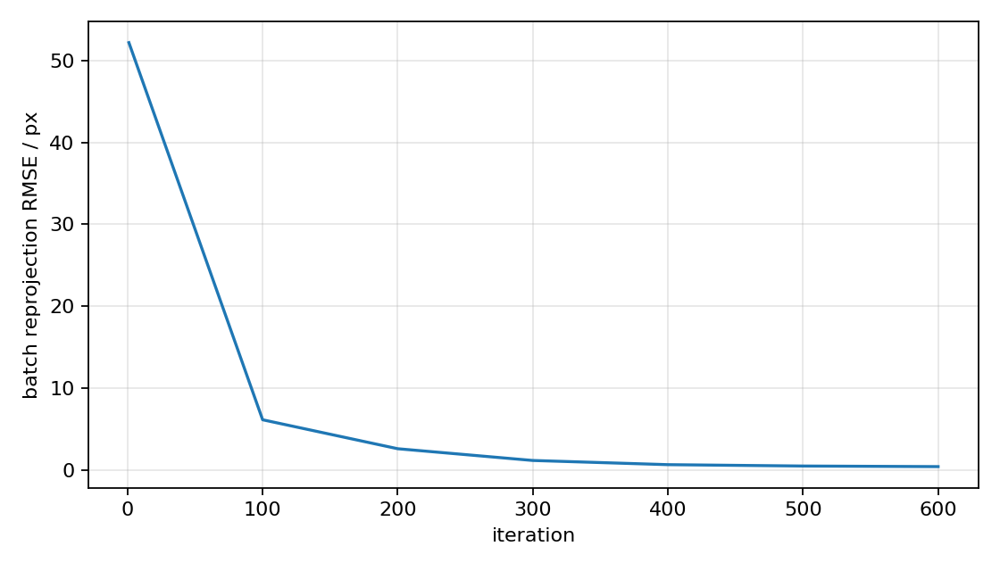
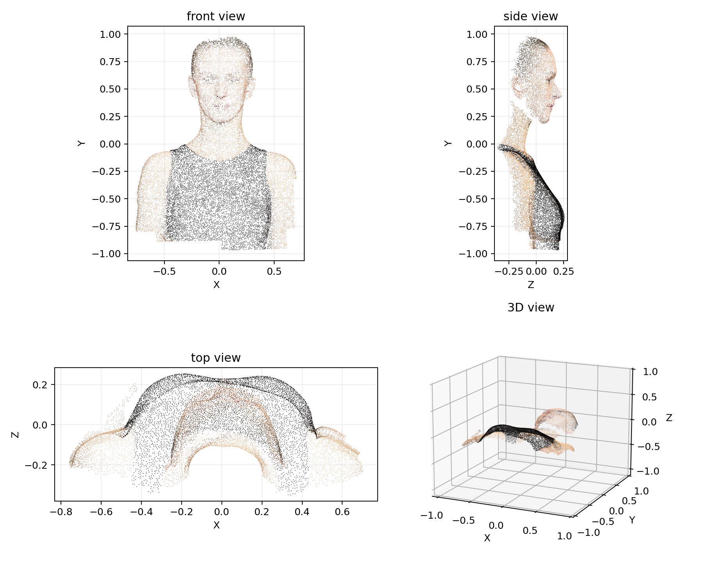
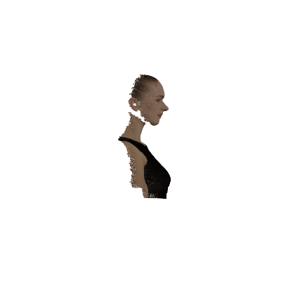
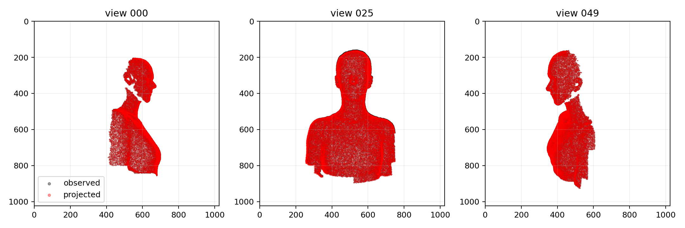
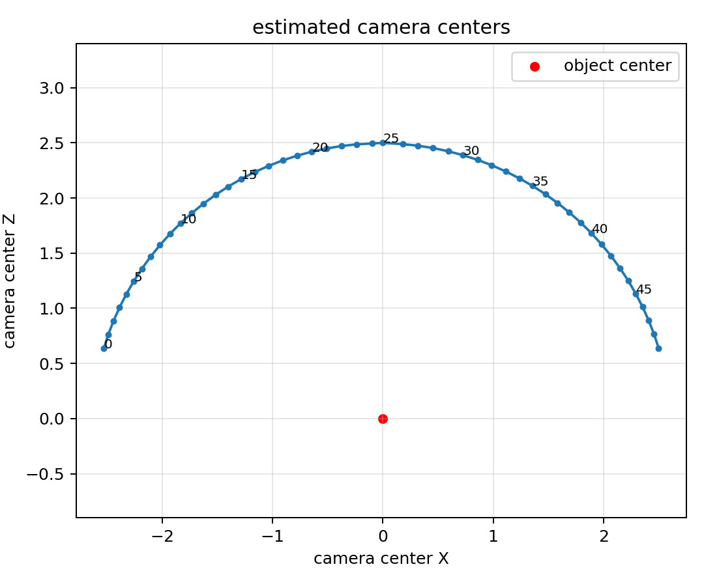
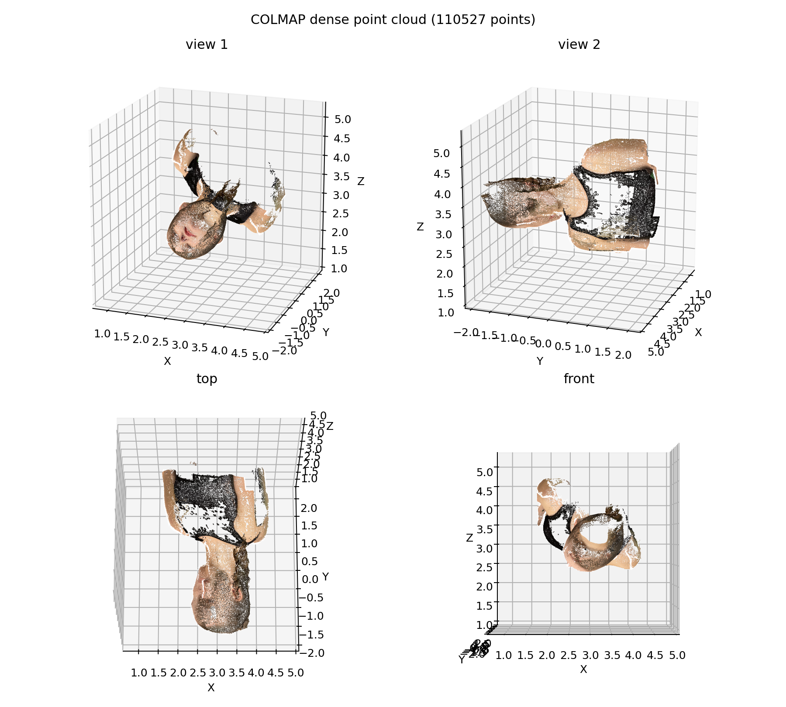

# Assignment 3 Report

## Task 1: Bundle Adjustment

这一部分用 PyTorch 做 BA。优化的变量有三类：3D 点、相机外参和焦距。

投影公式：

```text
[Xc, Yc, Zc]^T = R * [X, Y, Z]^T + T
u = -f * Xc / Zc + 512
v =  f * Yc / Zc + 512
```

loss 就是重投影误差：

```text
loss = mean((u_pred - u_obs)^2 + (v_pred - v_obs)^2)
```

因为 BA 的坐标系不唯一，我固定了中间视角 `view_025`，不然整体会飘。

运行：

```powershell
conda run -n dip python bundle_adjustment.py --iters 600 --batch-size 80000
```

结果：

```text
final full rmse: 0.403 px
final focal: 909.892
```

输出文件主要是：

```text
results/ba_points.obj
results/loss.png
results/point_cloud.gif
results/point_cloud_views.png
results/reprojection_check.png
results/camera_centers.png
```

loss：



点云：



GIF：



重投影检查，黑色是原始点，红色是投影回去的点：



相机位置：



## Task 2: COLMAP

说明：COLMAP 的脚本命令比较长，我借助 AI 帮忙整理了一下脚本，自己检查了路径和参数，然后在本机跑出来结果。

使用的 COLMAP：

```text
COLMAP 4.1.0.dev0 with CUDA
```

运行：

```powershell
.\run_colmap.ps1
```

流程：

```text
feature_extractor
exhaustive_matcher
mapper
image_undistorter
patch_match_stereo
stereo_fusion
```

结果：

```text
registered images: 50
sparse points: 1714
mean reprojection error: 0.664 px
dense fused points: 110527
```

稠密点云：



有些地方点比较散，应该是遮挡和纹理少导致匹配不太稳定。
