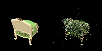
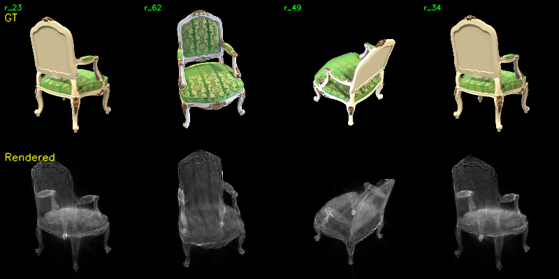
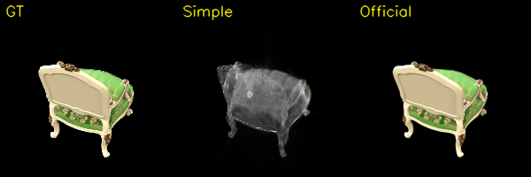

## 1. 运行环境

全部实验都在我自己的台式机上运行。显卡是 RTX 4070 SUPER，实际可用显存约 12 GB。my_3DGS 直接在 Windows 下运行，官方 3DGS 在同一台电脑的 WSL2 中运行，两者使用的是同一张显卡。

| 项目 | 配置 |
|---|---|
| GPU | NVIDIA GeForce RTX 4070 SUPER |
| 显存 | 12,282 MiB，约 12 GB |
| CPU | AMD Ryzen 7 9700X，8 核 16 线程 |
| 内存 | 约 24 GB |
| NVIDIA 驱动 | 596.49 |
| my_3DGS 环境 | Windows，Python 3.10，PyTorch 2.6.0 + CUDA 12.4 |
| 官方 3DGS 环境 | WSL2 Ubuntu 26.04，Python 3.10，PyTorch 2.6.0 + CUDA 12.4 |
| 数据集 | `chair`，100 张 800×800 多视角图像 |
| SfM | PyCOLMAP 4.1.0，PINHOLE 单相机模型 |

## 2. Task 1：使用 COLMAP 恢复相机和稀疏点云

运行 `mvs_with_colmap.py`，使用 PINHOLE 相机模型提取 SIFT 特征，然后做穷举匹配和增量式稀疏重建。100 张图像全部注册成功。

| 指标 | 结果 |
|---|---:|
| 注册图像数 | 100 / 100 |
| 稀疏三维点数 | 13,634 |
| 相机内参 | fx=1110.738，fy=1111.043，cx=400，cy=400 |
| 平均重投影误差 | 0.452 px |
| 中位重投影误差 | 0.263 px |
| 95% 分位重投影误差 | 1.588 px |

下面左侧是原图，右侧是稀疏点重投影。投影点基本落在椅子的轮廓和纹理上。背景和椅子腿上的点较少，后续需要用三维高斯覆盖这些空缺。

## 3. Task 2：my_3DGS

### 3.1 实现内容

每个三维高斯包含位置、四元数旋转、三轴缩放、不透明度和 RGB 颜色。缩放使用对数参数，颜色和不透明度使用 logit 参数，保证优化后取值范围合法。

三维协方差按照论文公式构造：

$$
\Sigma = R S S^T R^T = (RS)(RS)^T.
$$

世界坐标先通过 COLMAP 外参变换到相机坐标 $(X,Y,Z)$。透视投影的雅可比为：

$$
J =
\begin{bmatrix}
f_x/Z & 0 & -f_x\,X/Z^2 \\
0 & f_y/Z & -f_y\,Y/Z^2
\end{bmatrix},
$$

二维协方差为：

$$
\Sigma' = J R \Sigma R^T J^T.
$$

像素处的二维高斯值按作业给出的归一化概率密度计算。所有高斯按照相机深度从近到远排序，使用前向 alpha 合成：

$$
\alpha_i=o_i f_i,\qquad
T_i=\prod_{j<i}(1-\alpha_j),\qquad
C=\sum_i T_i\alpha_i c_i.
$$

### 3.2 训练设置

| 参数 | 设置 |
|---|---:|
| 训练分辨率 | 200×200 |
| 初始/最终高斯数 | 3,500 / 3,500 |
| 训练轮数 | 100 epoch |
| 视角更新次数 | 10,000 |
| 损失 | 前景加权 L1 + 0.1×边缘损失 |
| 优化器 | Adam |
| 总训练时间 | 3,838.75 s（63.98 min） |
| 峰值整卡显存 | 约 11.52 GB |

结果能看出椅子的整体轮廓，但颜色偏暗，表面有半透明感，椅背纹理和椅子腿不够清楚。

[my_3DGS GT/渲染视频](data/chair/my_3DGS/xiaoguo.mp4)

## 4. Task 3：my_3DGS 与官方 3DGS 对比

### 4.1 官方实现设置

官方代码使用 [Graphdeco 3DGS](https://github.com/graphdeco-inria/gaussian-splatting)。输入仍然是同一组 COLMAP 相机、点云和图像。图像缩放到 200×200，PNG 的透明区域合成为黑色。自己的 RTX 4070 SUPER 只有 12 GB 显存，所以这里训练 7,000 次，没有运行默认的 30,000 次配置。

CUDA 扩展在 WSL2 中编译，子模块版本如下：

- `diff-gaussian-rasterization`：`9c5c202`
- `simple-knn`：`86710c2`
- `fused-ssim`：`1272e21`

官方模型从 13,634 个 SfM 点开始，训练结束时有 106,367 个高斯。总时间为 50.61 秒，其中训练循环约 35 秒。

### 4.2 定量比较

下面的指标使用全部 100 个训练视角计算。这里没有单独划分测试集，因此这些数字只表示训练视角上的重建结果。

| 指标 | my_3DGS | 官方 3DGS |
|---|---:|---:|
| 分辨率 | 200×200 | 200×200 |
| 参数更新次数 | 10,000 | 7,000 |
| 最终高斯数 | 3,500 | 106,367 |
| 平均 L1 ↓ | 0.06647 | **0.00321** |
| 平均视角 PSNR ↑ | 15.84 dB | **38.43 dB** |
| SSIM ↑ | 0.7524 | **0.9961** |
| 前景 L1 ↓ | 0.29593 | **0.01461** |
| 轮廓 IoU ↑ | 0.8661 | **0.9929** |
| 总训练时间 ↓ | 3,838.75 s | **50.61 s** |
| 训练加速比 | 1× | **75.85×** |
| 实测渲染速度 ↑ | 13.85 FPS | **69.53 FPS** |
| 渲染加速比 | 1× | **5.02×** |
| 峰值整卡显存 ↓ | 约 11.52 GB | **约 1.79 GB** |

渲染速度包含保存图片的时间，不是单独统计 CUDA kernel。显存通过 `nvidia-smi` 读取，其中也包括 Windows 桌面占用。官方训练时比空闲状态多用了约 0.5 GB。

### 4.3 可视化比较

同一个 `r_0` 视角从左到右是 GT、my_3DGS、官方 3DGS：

[官方版 GT/渲染视频](data/chair/3DGS/xiaoguo.mp4)

官方结果的轮廓、颜色、纹理和细节都更清楚。my_3DGS 可以辨认出椅子，但高斯覆盖范围偏大，颜色偏灰，并且有半透明叠加。

### 4.4 差异原因

1. **光栅化方式不同。** 简化版对每个高斯和每个像素都计算二维高斯值，复杂度和显存近似正比于“高斯数×像素数”。官方实现先按屏幕 tile 分块，只处理会影响当前 tile 的高斯，并在 CUDA 中融合排序、求值和 alpha 合成。

2. **高斯数量不同。** 简化版固定为 3,500 个高斯，没有新增或删除点。官方版根据位置梯度克隆、分裂和裁剪高斯，最终达到 106,367 个，因此能覆盖椅腿和纹理等高频区域。

3. **颜色模型不同。** 简化版每个高斯只有固定 RGB。官方版使用三阶球谐函数表示视角相关颜色，可以拟合不同观察方向下的光照和外观变化。

4. **二维高斯参数化不同。** 简化版严格使用作业说明中的归一化二维高斯密度，峰值会随协方差行列式变化，使缩放、不透明度和亮度相互耦合。官方光栅器使用适合 splatting 的核函数和数值处理，优化更稳定。

5. **损失函数和优化策略不同。** 官方版组合 L1 与 SSIM，并有位置学习率调度、不透明度重置、球谐阶数逐步提升和自适应密化。简化版只有固定参数集合和较基础的 Adam 更新。

6. **显存管理不同。** 简化版依赖 PyTorch 自动微分，需要保存大尺寸中间张量。官方 CUDA 扩展只保留反向传播需要的数据，并避免构造完整的“高斯×像素”张量，因此高斯更多但显存更低。

## 5. 最终结果

my_3DGS 完成了 COLMAP 稀疏重建、三维高斯初始化、二维投影和 alpha 合成。它能重建椅子的大致形状，但固定 3,500 个高斯，并且直接用 PyTorch 计算全部“高斯×像素”，所以速度慢、显存高、图像不够清楚。

在相同的 200×200 分辨率下，官方 3DGS 的 PSNR 为 38.43 dB，my_3DGS 为 15.84 dB。官方训练快 75.85 倍，渲染快 5.02 倍。主要差别来自 CUDA tile 光栅化、自适应增密和球谐颜色。

## 6. 主要输出文件

- my_3DGS 模型：`data/chair/my_3DGS/moxing_000099.pt`
- my_3DGS 视频：`data/chair/my_3DGS/xiaoguo.mp4`
- 官方点云：`data/chair/3DGS/point_cloud/iteration_7000/point_cloud.ply`
- 官方渲染：`data/chair/3DGS/train/ours_7000/renders/`
- 官方视频：`data/chair/3DGS/xiaoguo.mp4`
